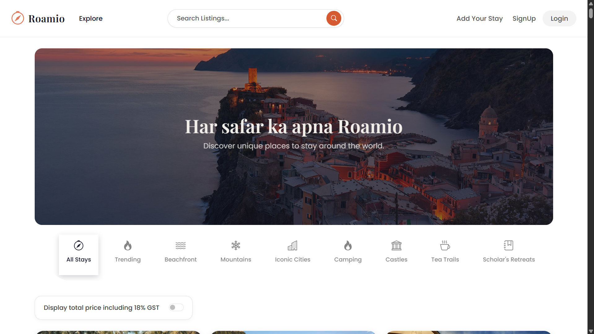
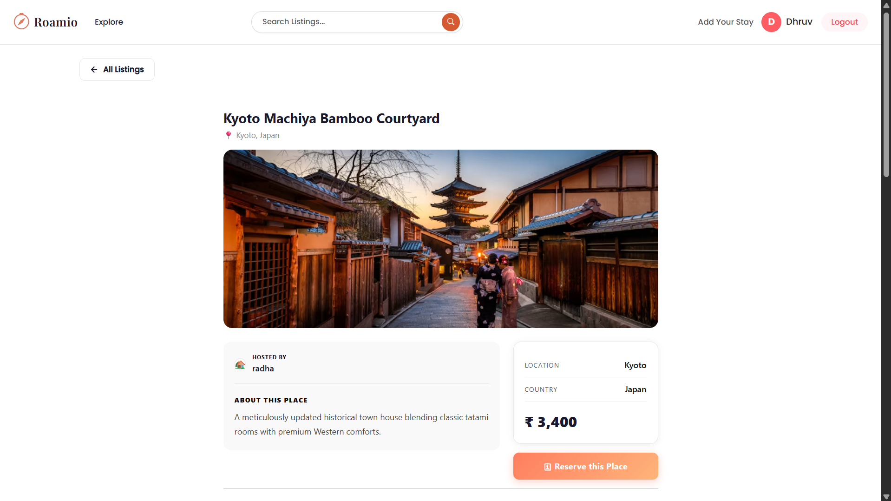
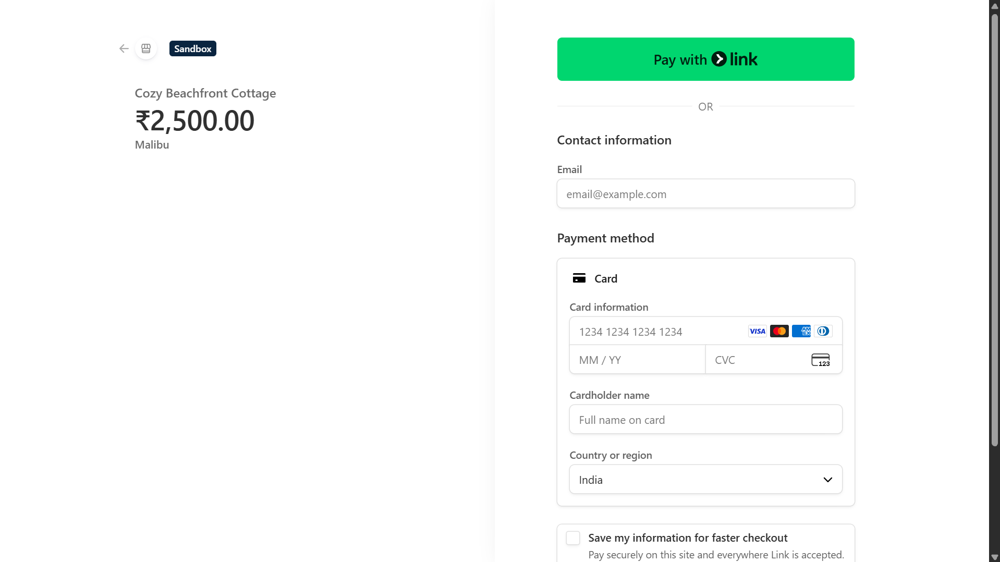

<div align="center">

# 🧭 Roamio

**A full-stack travel listing platform, inspired by Airbnb — built with the MERN stack, AI-powered features, and real payment processing.**

[](https://roamio-6s3k.onrender.com)
[](https://github.com/Dhruvpratap2006/Roamio)

</div>

---

## About

Roamio is a travel listing web app where users can create, browse, review, and book property listings — similar to Airbnb. I built it end-to-end: authentication, database design, media uploads, maps, an AI content assistant, and a payment flow with Stripe.

The goal was to go beyond a basic CRUD app and build something with production-level concerns — proper error handling, role-based access control, session management, and a couple of real AI integrations that actually solve a problem (writing listing descriptions, summarizing reviews) instead of being tacked on for buzzword value.

---

## Features

- **Auth & Access Control** — Signup/login via Passport.js (local strategy), sessions stored in MongoDB using `connect-mongo`, and middleware (`isLoggedIn`, `isOwner`) to make sure only the right users can edit or delete listings.
- **Listings CRUD** — Full create/read/update/delete flow for property listings, with image uploads handled through Cloudinary and input validation via Joi.
- **Maps & Geocoding** — Every listing address is geocoded using Mapbox, so each listing page shows an interactive map with the exact location pinned.
- **AI Description Generator** — Hosts can auto-generate a listing description from basic details (title, category, location) using an LLM via the OpenRouter API, instead of writing one from scratch.
- **AI Review Summarizer** — When a listing has multiple reviews, the app analyzes them and shows a quick sentiment summary (positive/negative/mixed) plus a short AI-generated overview, so users don't have to read every review individually. If the AI API is down or rate-limited, the page still works normally — it just skips the summary.
- **Payments** — Stripe Checkout integration for bookings, handled server-side to keep payment data secure and prevent tampering or duplicate bookings.
- **Rate Limiting** — `express-rate-limit` on key routes to prevent abuse.

---

## Tech Stack

| Layer | Technologies |
|---|---|
| Frontend | EJS, Bootstrap 5, Vanilla JS, CSS3 |
| Backend | Node.js, Express.js |
| Database | MongoDB Atlas, Mongoose |
| Auth | Passport.js, express-session, connect-mongo |
| AI | OpenRouter API |
| Media & Maps | Cloudinary, Mapbox GL JS |
| Payments | Stripe |
| Hosting | Render |

---

## Screenshots

<details>
<summary>Click to expand</summary>

### Homepage


### Explore Listings


### Listing Details & Map


### AI Description & Sentiment Summary


### Stripe Checkout


</details>

---

## Project Structure

```
Roamio/
├── controllers/     # Route logic
├── middleware/      # Auth checks, validation
├── models/          # Mongoose schemas (User, Listing, Review)
├── public/          # Static assets (css, js, images)
├── routes/          # Express route definitions
├── utils/           # Error handling helpers (wrapAsync, ExpressError)
├── views/           # EJS templates
├── app.js           # App entry point
└── cloudConfig.js   # Cloudinary setup
```

---

## Running It Locally

**Prerequisites:** Node.js v18+, a MongoDB Atlas cluster (or local MongoDB)

```bash
git clone https://github.com/Dhruvpratap2006/Roamio.git
cd Roamio
npm install
```

Create a `.env` file in the root with:

```
ATLAS_DB_URL=mongodb+srv://<username>:<password>@cluster.mongodb.net/roamio
SESSION_SECRET=your_session_secret
CLOUD_NAME=your_cloudinary_name
CLOUD_API_KEY=your_cloudinary_key
CLOUD_API_SECRET=your_cloudinary_secret
MAP_TOKEN=your_mapbox_public_token
STRIPE_SECRET_KEY=your_stripe_secret_key
OPENROUTER_API_KEY=your_openrouter_api_key
```

Run it:

```bash
npm run dev      # development, with hot reload
npm start        # production
```

App runs at `http://localhost:8080`.

---

## Roadmap

- [ ] Booking calendar with date-blocking
- [ ] Search & filter by location + amenities
- [ ] Host dashboard with booking/revenue stats
- [ ] Email notifications on booking (Nodemailer)

---

## Author

**Dhruv Pratap Singh**
B.Tech CSE (Data Science), Noida Institute of Engineering & Technology

- GitHub: [@Dhruvpratap2006](https://github.com/Dhruvpratap2006)
- LinkedIn: [dhruv-pratap](https://www.linkedin.com/in/dhruv-pratap-1a3aaa344/)

---

Licensed under MIT. If you find this useful, a ⭐ would mean a lot!
